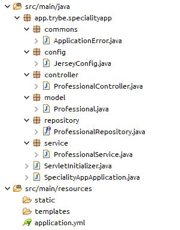

### Termos e acordos

Ao iniciar este projeto, você concorda com as diretrizes do Código de Ética e Conduta e do Manual da Pessoa Estudante da Trybe.

---

# Boas vindas ao repositório do desafio da Aceleração Java!

Você já usa o GitHub diariamente para desenvolver os exercícios, certo? Agora, para desenvolver o desafio, você deverá seguir as instruções a seguir. Fique atento a cada passo, e se tiver qualquer dúvida, nos envie por _Slack_! #vqv 🚀

Aqui você vai encontrar os detalhes de como estruturar o desenvolvimento do seu desafio a partir deste repositório, utilizando uma branch específica e um _Pull Request_ para colocar seus códigos.

---
# Instruções para entregar seu projeto

## Não se esqueça de consultar as documentações!

⚠️ **Importante**:

Esse projeto tem como intuito te treinar para ter mais familiaridade com a documentação de aplicações, por tanto, poderão haver alguns comandos ou atributos que não estão no curso, mas que devem ser descritos no decorrer dos requisitos.

Nesses casos, é importante se atentar a aquilo que o requisito pede, e lembrar sempre de utilizar a [documentação oficial](https://docs.oracle.com/en/java/javase/11/) do Java para pesquisar detalhes sobre comandos.


## Antes de começar a desenvolver

Lembre-se que você pode consultar nosso conteúdo sobre [Git & GitHub](https://course.betrybe.com/intro/git/) sempre que precisar!

1. Clone o repositório
  * Por exemplo: `git clone git@github.com:tryber/desafio-aceleracao.git`
  * Entre no diretório do repositório que você acabou de clonar:
    * neste caso `cd desafio-aceleracao`

2. Instale as dependências:
    * `mvn install`

3. Crie uma branch a partir da branch `main`

  * Verifique que você está na branch `main`
    * Exemplo: `git branch`
  * Se não estiver, mude para a branch `main`
    * Exemplo: `git checkout main`
  * Agora, crie uma branch onde você vai guardar os commits do seu desafio
    * Você deve criar uma branch no seguinte formato: `nome-de-usuario-nome-do-desafio`
    * Exemplo:
      * `git checkout -b joaozinho-acc-java-sample`

4. Adicione a sua branch com o novo `commit` ao repositório remoto

  - Usando o exemplo anterior:
    - `git push -u origin joaozinho-acc-java-sample`

5. Crie um novo `Pull Request` _(PR)_
  * Vá até a aba de _Pull Requests_ deste repositório no GitHub
  * Clique no botão verde _"New pull request"_
  * Clique na caixa de seleção _"Compare"_ e escolha a sua branch **com atenção**
  * Clique no botão verde _"Create pull request"_
  * Adicione uma descrição para o _Pull Request_ e clique no botão verde _"Create pull request"_
  * **Não se preocupe em preencher mais nada por enquanto!**
  * Volte até a página de _Pull Requests_ do repositório e confira que o seu _Pull Request_ está criado

 ⚠️ **Lembre-se do CheckStyle! Deixe seu Eclipse configurado para arrumar o estilo automaticamente. Qualquer dúvida, volte no conteúdo.**

---

## Durante o desenvolvimento

* ⚠ **PULL REQUESTS COM ISSUES NO CHECKSTYLE NÃO SERÃO AVALIADAS, ATENTE-SE PARA RESOLVÊ-LAS ANTES DE FINALIZAR O DESENVOLVIMENTO!** ⚠

* Faça `commits` das alterações que você fizer no código regularmente

* Lembre-se de sempre após um (ou alguns) `commits` atualizar o repositório remoto

* Os comandos que você utilizará com mais frequência são:
  1. `git status` _(para verificar o que está em vermelho - fora do stage - e o que está em verde - no stage)_
  2. `git add` _(para adicionar arquivos ao stage do Git)_
  3. `git commit` _(para criar um commit com os arquivos que estão no stage do Git)_
  4. `git push -u origin nome-da-branch` _(para enviar o commit para o repositório remoto na primeira vez que fizer o `push` de uma nova branch)_
  5. `git push` _(para enviar o commit para o repositório remoto após o passo anterior)_

---

## Depois de terminar o desenvolvimento (opcional)

Para **"entregar"** seu projeto, siga os passos a seguir:

* Vá até a página **DO SEU** _Pull Request_, adicione a label de _"code-review"_ e marque seus colegas
  * No menu à direita, clique no _link_ **"Labels"** e escolha a _label_ **code-review**
  * No menu à direita, clique no _link_ **"Assignees"** e escolha **o seu usuário**
  * No menu à direita, clique no _link_ **"Reviewers"** e digite `students`, selecione o time `tryber/students-sd-0x`

Se ainda houver alguma dúvida sobre como entregar seu projeto, [aqui tem um video explicativo](https://vimeo.com/362189205).

---

# Requisitos do desafio

# Desafio Agregador: Sistema de Cadastro de Especialidades 👨‍🚒👩‍🚒

Imagine que você está trabalhando para uma empresa especializada em RH (recursos humanos) e vai colaborar com o time de desenvolvimento. Sua atribuição é implementar um sistema web responsável por consultar, cadastrar, editar e deletar profissionais e suas especialidades no banco de dados da empresa.

A pessoa responsável pela arquitetura do software montou uma especificação técnica, a qual foi designada como  demanda para você. Veja os detalhes a seguir:

> ##### ESPECIFICAÇÃO TÉCNICA
> ------------
> **Projeto**: Cadastro de Especialidades
>
> **Objetivo**: A empresa conta com um conjunto de sistemas integrados para o gerenciamento de qualificações dos profissionais, todos construídos com framework Quarkus. Entretanto, devido a mudanças recentes na infraestrutura e nos contratos, todo esse core está sendo portado para o Spring Boot. Portanto, este projeto tem como objetivo migrar o módulo de cadastro de especialidades para a nova arquitetura escolhida pela empresa.
>
> **Requisitos**:
>
> - Desenvolver um novo projeto utilizando o framework Spring Boot na versão `2.x`;
> - Definir `maven` como gerenciador de dependências e ferramenta de build do projeto;
> - Implementar as 4 operações básicas de um CRUD (GET, POST, PUT e DELETE) utilizando as especificações do `JAX-RS`, em que cada uma dessas operações deverá corresponder a um caminho na API Rest:
> 	- **GET path = "/api/professional/all"**: deverá trazer todos os registros cadastrados dos profissionais e suas especialidades. Caso não encontre nenhum registro, deverá retornar um `404 Not Found`, com uma mensagem de erro: "*Nenhum registro foi encontrado!*";
> 	- **POST path = "/api/professional/add"**: deverá cadastrar um novo registro no banco de dados com retorno `201 Created` e a string "*Inserido*". O id é autogerado e portanto não pode ser informado manualmente. Caso seja um `400 Bad Request`, uma mensagem "*Não é permitido inserir novos registros com ID explícito*" será exibida.
> 	- **PUT path = "/api/professional/edit/{id}"**: deverá editar um registro já existente na base de dados, retornar um `200 Ok` e a string "*ID [%d] atualizado*", onde o `%d` representa o ID editado. O ID do cadastro é informado manualmente na URL e, caso ele não exista, um `404 Not Found` com a mensagem "*Não é possível editar, o ID informado não existe*" deve ser retornado;
> 	- **DELETE path = "/api/professional/delete/{id}"**: deverá deletar um registro já existente da base de dados, retornar um `200 Ok` e a string "*ID [%d] removido*", onde o `%d` representa o ID editado. O ID do cadastro é informado manualmente na URL e, caso ele não exista, um `404 Not Found` com a mensagem "*Não é possível deletar, o ID informado não existe*" deve ser retornado;
> - Construir a camada de acesso a dados, utilizando os conceitos de abstração da base de dados disponíveis nas especificações do `JPA`;
> - Implemente os campos presentes na entidade representacional do profissional e sua especialidade com os atributos: `id`, `name` e `speciality`;
> - Configurar devidamente as propriedades do sistema em um arquivo `.yml` conforme a lista abaixo:
>	- Porta de execução da aplicação deve ser a `8080`;
>	- Datasource apontado para acessar o `H2 Database` com as seguintes credenciais: `username = speciality-app` / `password = speciality-app!`;
>	- Definir as propriedades do logger para gerar um arquivo de logs em uma pasta especificada `./logs/speciality-app.log`, assim como o level de logging das informações.
>	- O projeto deverá ser empacotado no formato `.war` para o deploy no server container do wildfly da empresa
>
>

# Visão geral da Demanda 📄

- **Etapa 1 ☕**: O primeiro passo para desenvolver seu sistema é criar a estrutura do projeto.
  - Como este repositório já possui uma estrutura parcialmente pronta, você vai ter que criar um projeto novo à parte, e em seguida trazer as configurações e códigos necessárias para o desafio.
  - Para agilizar o processo, você pode usar uma IDE como o [Eclipse IDE for Enterprise Java and Web Developers](https://www.eclipse.org/downloads/packages/ "Página de downloads do eclipse") com o [plugin](https://marketplace.eclipse.org/content/spring-tools-4-aka-spring-tool-suite-4 "Plug-in do spring para eclipse IDE") do Spring Boot instalado, e criar um projeto do tipo "Spring Starter Project". Uma outra opção é criar o projeto utilizando o próprio site do [Spring Initializr](https://start.spring.io/ "Gerador de projetos Spring Boot").
  - Se este desafio já tiver sido importado no Eclipse, você pode precisar renomeá-lo antes de criar um novo, já que o Eclipse não permite nomes duplicados. Cuide para renomear apenas o projeto, e não renomeie suas classes, estrutura ou nome do artefato no pom.xml.
  - Ao criar o projeto novo (seja no Eclipse ou no Spring Initializr), adote as seguintes especificações:
    - **Type**: *Maven Project*
    - **Packaging**: *War*
    - **Java Version**: *11*
    - **Group**: *app.trybe*
    - **Artifact**: *speciality-app*
    - **Name**: *speciality-app*
    - **Package**: *app.trybe.specialityapp*
  - Adicione as dependências necessárias: `spring jpa`, `spring jersey`, `h2 database`;

- **Etapa 2 ☕**: Agora você precisar pegar algumas coisas do novo projeto e transferi-las para este desafio. Primeiro, modifique o `pom.xml` deste desafio e inclua todas as configurações (parent, dependências, plugins, etc) que estiverem no `pom.xml` do novo projeto.
  - **IMPORTANTE**: deixe as dependências e os plugins agrupadas na mesma tag `<dependencies>` e `<plugins>`, respectivamente. **NÃO MODIFIQUE** os plugins e dependências já fornecidos pelo desafio.

- **Etapa 3 ☕**: Agora, usando seu gerenciador de arquivos, copie os arquivos do novo projeto criado (com exceção do `pom.xml`) para dentro deste desafio, mantendo a mesma estrutura de diretórios.
  - **IMPORTANTE**: você deve incluir os arquivos novos na mesma estrutura do projeto, mas **não substitua nenhum arquivo**. Por exemplo, ao copiar a pasta `src`, alguns arquivos podem já estar presentes. Muitos gerenciadores de arquivos vão te dar a opção de unir as pastas sem substituir os arquivos (essa opção às vezes é chamada de _merge_, mas não tem a ver com o 'merge' do git). Na dúvida, utilize o `git status` para verificar se algum arquivo foi substituído.

- **Etapa 4 ☕**: Quando criamos o projeto, por padrão, ele também cria um arquivo `application.properties`, responsável por guardar as propriedades de configuração da aplicação no formato "chave"x"valor". Para este cenário, vamos remover esse arquivo e criar outro de mesmo nome, porém com a extensão .yml. Desta forma, obtemos um novo arquivo nomeado com `application.yml`, o qual armazena as propriedades do nosso sistema por indentação. Dentro deste arquivo você vai precisar declarar três blocos:
	1. Bloco de configuração contendo o apontamento do sistema para porta `8080`
	2. Bloco de configuração do datasource contendo o apontamento para o banco de dados da aplicação no endereço `dbc:h2:mem:speciality_database` e credenciais de acesso `username = speciality-app` / `password = speciality-app!`;
	3. Bloco de configuração do logging level como `INFO` registro de log salvo no arquivo `./logs/speciality-app.log`.

- **Etapa 5 ☕**: A partir dessa etapa, você deve criar os seguintes pacotes dentro do pacote principal (*app.trybe.specialityapp*):  `commons`, `config`, `controller`, `model`, `repository` e `service`. Eles servirão para manter a organização do projeto;

- **Etapa 6 ☕**: De acordo com a especificação técnica, o objeto que representa o profissional e sua especialidade é formado por três campos: `Integer id`, `String name` e `String speciality`. Você pode criar uma classe chamada `Professional` para isso.
**Anota aí📣**: Utilize as especificações do Spring JPA para atender aos requisitos de abstração (*@Entity, @Id, @GeneratedValue, @Column, etc.*);

- **Etapa 7 ☕**: O repositório com as operações no banco de dados não precisa conter a implementação explícita das consultas, mas nada impede de fazê-las, especialmente um método que realize a busca por ID do Professional.

- **Etapa 8 ☕**: Será preciso criar uma classe para conter a lógica das nossas regras da aplicação. Conforme mencionado na especificação técnica, as operações de GET, POST, PUT e DELETE possuem comportamentos que serão acionados à medida em que certas ações são requisitadas na nossa API Rest. Quem será responsável por tratar esses dados será o SERVICE;

	> Dica 💡: Para obter um melhor entendimento sobre as regras da aplicação, revise a especificação técnica.

- **Etapa 9 ☕**: Você deve criar no subpacote `commons` uma classe `ApplicationError`, que deverá ser usada para retonar erros durante uma requisição. Essa classe deverá disponibilizar o código de status da requisição, e uma mensagem de erro personalizada;

- **Etapa 10 ☕**: Para que o servidor web consiga interpretar corretamente nossas requisições, será necessário que uma classe registre nossos beans na inicialização como um configuração do app no subpacote `config`. Use o modelo abaixo como referência:

	```java
	@Configuration
	@ApplicationPath("/api")
	public class JerseyConfig extends ResourceConfig {

	  private Logger logger = LoggerFactory.getLogger(JerseyConfig.class);

	  /**
	   * Construtor para o JerseyConfig.
	   *
	   */
	  public JerseyConfig() {
	    packages(SpecialityAppApplication.class.getPackageName());
	    register(new AbstractBinder() {

	      @Override
	      protected void configure() {
		logger.info("Configurando binder");
	      }
	    });
	  }
	}
	```

- **Etapa 11 ☕**: O seu controlador será a classe responsável por receber as requisições para as operações e devolvê-las ao usuário no formato `json`. Utilize as especificações do JAX-RS para construir a API REST do sistema seguindo os requisitos abaixo:
	- Cria um método `findAll` associado à operação `GET` que irá consultar e retornar todos os registros;
	- Cria um método `insert` associado à operação `POST` que irá inserir um novo registro;
	- Cria um método `edit` associado à operação `PUT` que irá editar um registro existente;
	- Cria um método `delete` associado à operação `DELETE` que irá remover um registro existente;

  **:warning: Nota:** Você deve utilizar as especificações do JAX-RS (neste caso, provida pelo Jersey) na construção da sua API. Em especial, tome cuidado para usar as anotações corretas (use `@Path`, e não `@RequestMapping`, por exemplo).

> Dica 💡: Use a estrutura do projeto a seu favor! Aproveite a nomenclatura base da classe Professional como apoio para todas a classes do fluxo. Tome como exemplo a figura abaixo:
>
> 

> **Anota aí📣:** Você também pode usar o [Postman](https://www.postman.com/downloads/ "Postman downloads") para testar as requisições da sua aplicação quando estiver devidamente funcionando em http://localhost:8080/api/professional/{sua-operacao-aqui}. Para isso, você pode subir o servidor com sua aplicação utilizando o comando `mvn spring-boot:run` no terminal, ou através da opção "Run"/"Run as..." do Eclipse.
---

# Avisos Finais

Ao finalizar e submeter o desafio, não se esqueça de avaliar sua experiência preenchendo o formulário. Leva menos de 3 minutos!

Link: [Formulário](https://be-trybe.typeform.com/to/PsefzL2e)

O avaliador automático não necessariamente avalia seu projeto na ordem em que os requisitos aparecem no readme. Isso acontece para deixar o processo de avaliação mais rápido. Então, não se assuste se isso acontecer, ok?

---
